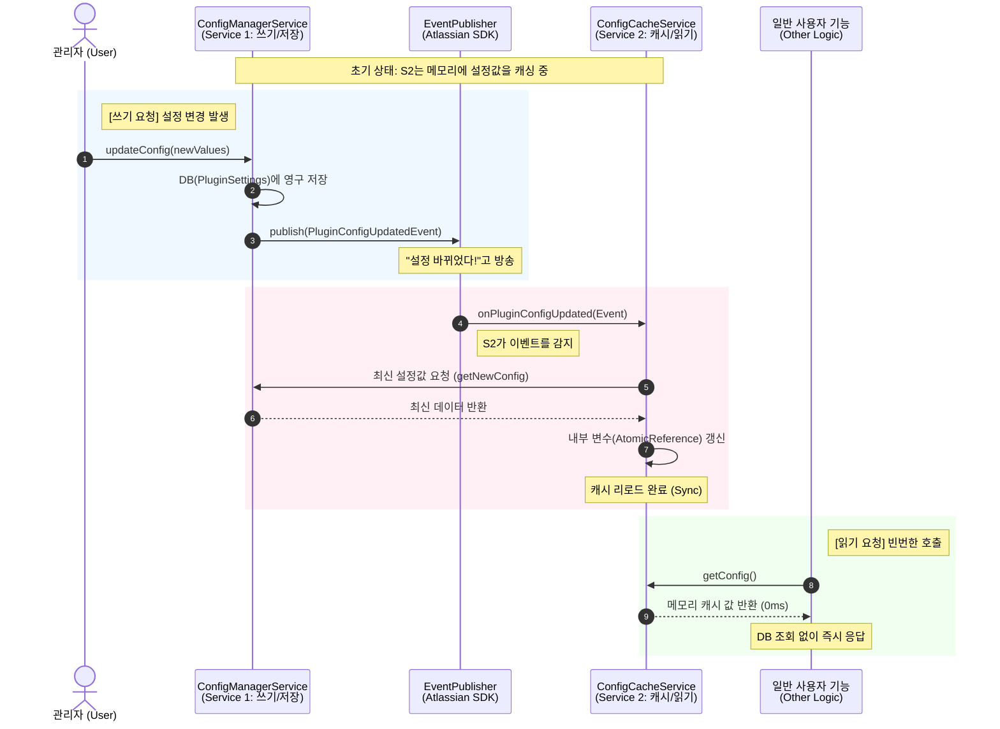

네, 말씀하신 **"설정 변경(Service 1) → 이벤트 발행 → 캐시 갱신(Service 2)"** 흐름을 시퀀스 다이어그램(Sequence Diagram)으로 도식화했습니다.

이 그림을 보면 **쓰기(Write)는 신중하게**, **읽기(Read)는 빠르게** 처리되는 구조가 한눈에 들어올 것입니다.

### 📊 Jira 플러그인 설정 동기화 흐름도

---

### 🔍 도식 설명

1. **Blue Zone (쓰기 & 전파):**

- 관리자가 설정을 바꾸면 `Service 1`은 DB에 안전하게 저장합니다.
- 저장이 완료되면 **즉시** `EventPublisher`를 통해 "설정이 바뀌었다"는 사실만 방송합니다.

2. **Red Zone (캐시 동기화):**

- `Service 2`는 평소엔 조용히 있다가, 이벤트가 날아오면 그제서야 반응합니다.
- `Service 1`에게 "최신 값 줘"라고 요청해서 자신의 메모리(변수)를 갈아 끼웁니다.

3. **Green Zone (고속 조회):**

- 다른 기능들이 설정을 필요로 할 때는 `Service 1`(DB)을 거치지 않고, `Service 2`의 메모리 값을 바로 가져갑니다.
- 덕분에 DB 부하가 '0'이 되며 성능이 극대화됩니다.

이 다이어그램을 참고하면서 개발하시면 구조를 잡는 데 훨씬 도움이 될 것입니다. 혹시 **Mermaid 코드**가 필요하시면 그대로 복사해서 기술 문서(Wiki 등)에 넣으셔도 됩니다!
