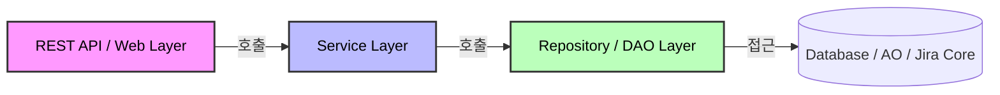

좋습니다. 지금까지 나온 내용에 **`@Repository`**와 **`@Named`**까지 포함해서, **"Jira 플러그인 개발 어노테이션 완전판"**을 정리해 드리겠습니다.

이 표 하나면 더 이상 헷갈릴 일이 없을 겁니다.

---

### 1. 계층별 어노테이션 지도 (Architecture Map)

플러그인 구조상 데이터는 위에서 아래로 흐릅니다. 각 계층에 맞는 "이름표"를 붙여야 합니다.



1. **`@Path` (+`@Component`)**: 손님(HTTP 요청) 받는 곳 (A)
2. **`@Service`**: 실제 요리(비즈니스 로직) 하는 곳 (B)
3. **`@Repository`**: 재료(데이터) 꺼내오는 곳 (C)

---

### 2. 어노테이션 상세 비교 (The Complete List)

| 구분                 | 어노테이션                     | 설명 및 용도                                                                                       | 실무 팁 (Best Practice)                                                 |
| -------------------- | ------------------------------ | -------------------------------------------------------------------------------------------------- | ----------------------------------------------------------------------- |
| **빈 등록** (Spring) | **`@Component`**               | **가장 기본.** 일반적인 객체나 유틸리티 클래스 등록 시 사용.                                       | 딱히 붙일 이름이 애매하면 이거 쓰세요.                                  |
|                      | **`@Service`**                 | **비즈니스 로직.** `@Component`와 기능은 같지만 "여기 로직 있어요"라고 명시.                       | `Manager`, `Service`, `Helper` 클래스에 붙이세요.                       |
|                      | **`@Repository`**              | **DB 접근 계층(DAO).** DB 예외를 Spring 예외로 변환해주는 기능이 추가됨.                           | AO 접근이나 Raw SQL을 쓰는 클래스(`MyDao`)에 붙이세요.                  |
|                      | **`@Named`**                   | **이름 지정.** 빈의 이름을 명시적으로 지정하거나, 같은 타입의 빈이 여러 개일 때 구분(Qualifier)함. | 잘 안 씁니다. 빈 이름 충돌 날 때만 쓰세요. (JSR-330 표준)               |
| **OSGi** (Atlassian) | **`@ComponentImport`**         | **수입(Import).** 내 플러그인 밖(Jira Core, 타 플러그인)의 기능을 가져올 때.                       | `IssueManager`, `ActiveObjects` 등 남의 것을 필드에 선언할 때 **필수**. |
|                      | **`@ExportAsService`**         | **수출(Export).** 내 기능을 남들이 쓸 수 있게 공개할 때.                                           | 보통은 안 씁니다. "공용 라이브러리" 만들 때만 쓰세요.                   |
| **주입** (DI)        | **`@RequiredArgsConstructor`** | **(Lombok)** `final` 필드용 생성자 자동 생성.                                                      | **강력 추천.** 코드가 깔끔해지고 `@Inject`를 안 써도 됨.                |
|                      | **`@Inject` / `@Autowired**`   | 생성자나 필드에 주입하라고 지시.                                                                   | `@RequiredArgsConstructor`를 쓴다면 **쓰지 마세요.**                    |
| **웹** (REST)        | **`@Path`**                    | URL 경로 매핑. (Spring의 `@Controller` / `@RequestMapping` 역할)                                   | REST API 클래스 맨 위에 붙입니다.                                       |

---

### 3. 실전 통합 코드 (Copy & Paste 용)

이 코드는 **Controller -> Service -> Repository**로 이어지는 완벽한 흐름을 보여줍니다.

#### [1단계] 데이터 저장소 (`@Repository`)

DB에 직접 접근하는 클래스입니다.

```java
package com.example.plugin.dao;

import com.atlassian.activeobjects.external.ActiveObjects;
import com.atlassian.plugin.spring.scanner.annotation.imports.ComponentImport;
import lombok.RequiredArgsConstructor;
import org.springframework.stereotype.Repository; // 중요!

@Repository // [핵심] "여기는 DB 다루는 곳입니다"
@RequiredArgsConstructor
public class IssueRepository {

    @ComponentImport // 외부(AO 플러그인)에서 가져옴
    private final ActiveObjects ao;

    public void save(String data) {
        // AO 또는 SQL 로직...
    }
}

```

#### [2단계] 비즈니스 로직 (`@Service`)

데이터를 가공하고 업무를 처리합니다.

```java
package com.example.plugin.service;

import com.example.plugin.dao.IssueRepository;
import lombok.RequiredArgsConstructor;
import org.springframework.stereotype.Service; // 중요!

@Service // [핵심] "여기는 로직 돌리는 곳입니다"
@RequiredArgsConstructor
public class IssueService {

    // [내부] 내가 만든 Repository (Import 불필요)
    private final IssueRepository issueRepository;

    public void processAndSave(String data) {
        String processedData = data.trim().toUpperCase();
        issueRepository.save(processedData);
    }
}

```

#### [3단계] 같은 타입의 빈이 2개일 때 (`@Named` 사용 예시)

만약 `IssueService` 구현체가 2개(Fast, Slow)라면?

```java
@Service
@Named("fastService") // 이름을 명시
public class FastIssueService implements MyService { ... }

@Service
@Named("slowService")
public class SlowIssueService implements MyService { ... }

// 사용하는 곳
@Component
public class MyResource {

    private final MyService myService;

    // 생성자 주입 시 @Named로 콕 집어서 가져옴 (Qualifier 역할)
    public MyResource(@Named("fastService") MyService myService) {
        this.myService = myService;
    }
}

```

---

### 4. 최종 요약 (이럴 땐 이거!)

1. **일반적인 로직이다?** 👉 **`@Service`**
2. **DB 쿼리 날리거나 AO 쓴다?** 👉 **`@Repository`**
3. **그냥 헬퍼 클래스다?** 👉 **`@Component`**
4. **Jira Core 기능(Manager)이 필요하다?** 👉 필드에 **`@ComponentImport`**
5. **생성자 코드 짜기 귀찮다?** 👉 클래스 위에 **`@RequiredArgsConstructor`**
6. **똑같은 인터페이스를 구현한 클래스가 여러 개다?** 👉 **`@Named("이름")`** 로 구분

이제 이 규칙대로만 어노테이션을 붙이시면, Jira 10 환경에서도 완벽하게 동작하는 플러그인을 만드실 수 있습니다.
