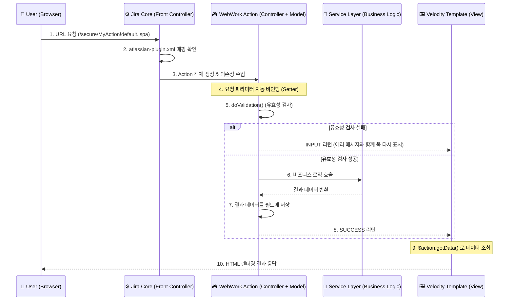

Jira의 MVC 패턴(WebWork 기반)은 일반적인 Spring MVC와는 흐름이 조금 다릅니다.

**Jira MVC의 핵심**은 **"Action이 곧 Model이자 Controller"**라는 점입니다. 뷰(Velocity Template)는 Action 객체 자체를 바라보고 데이터를 꺼내갑니다.

Jira 플러그인 개발의 표준인 **WebWork MVC 전체 구조도**와 **모범 코드(Best Practice)**를 정리해 드립니다.

---

### 1. Jira MVC 아키텍처 도식화

사용자의 요청이 들어와서 화면이 그려지기까지의 흐름입니다.



---

### 2. 모범 코드 (Best Practice)

Jira 10(Platform 7) 환경에 맞춘, **안전하고 유지보수하기 쉬운 코드**입니다.

#### A. Controller (Action 클래스)

- **핵심:** `JiraWebActionSupport` 상속, 생성자 주입, `doValidation`/`doExecute` 분리.
- **어노테이션:** Action 클래스에는 `@Named`나 `@Component`를 붙여야 스캐너가 인식하여 의존성을 주입해줍니다.

```java
package com.example.plugin.web;

import com.atlassian.jira.web.action.JiraWebActionSupport;
import com.atlassian.plugin.spring.scanner.annotation.imports.ComponentImport;
import com.example.plugin.service.MyAwesomeService;
import lombok.Getter;
import lombok.Setter;
import javax.inject.Inject;
import javax.inject.Named;

// [Controller & Model]
// Setter는 파라미터를 받고, Getter는 뷰(Velocity)에 데이터를 줍니다.
@Named("myWebAction") // Spring Bean으로 등록되어야 주입이 가능함
public class MyWebAction extends JiraWebActionSupport {

    // 1. 의존성 주입 (Service Layer)
    private final MyAwesomeService myAwesomeService;

    // 2. 화면과 주고받을 데이터 (Lombok 활용)
    @Setter private String targetProjectKey; // URL 파라미터 수신 (?targetProjectKey=TEST)
    @Getter private int issueCount;          // 뷰로 송신 ($action.issueCount)

    @Inject // Action은 생성자 주입 시 @Inject가 명시적으로 필요한 경우가 많음 (환경에 따라 다름)
    public MyWebAction(MyAwesomeService myAwesomeService) {
        this.myAwesomeService = myAwesomeService;
    }

    // 3. 유효성 검사 (Validate)
    @Override
    protected void doValidation() {
        // 부모 검증 로직 실행 (권한 체크 등)
        super.doValidation();

        if (targetProjectKey == null || targetProjectKey.isEmpty()) {
            // 에러 메시지 추가 (화면에 빨간 박스로 뜸)
            addErrorMessage("프로젝트 키를 입력해주세요.");
        }
    }

    // 4. 비즈니스 로직 실행 (Execute)
    @Override
    public String doExecute() throws Exception {
        // Service에게 일 시키기
        this.issueCount = myAwesomeService.getIssueCount(targetProjectKey);

        // 결과에 따라 뷰 선택 (SUCCESS -> success.vm)
        return SUCCESS;
    }

    // 5. 뷰에서 호출할 헬퍼 메서드
    public String getCurrentTime() {
        return java.time.LocalDateTime.now().toString();
    }
}

```

#### B. View (Velocity Template)

- **위치:** `src/main/resources/templates/my-view.vm`
- **핵심:** `$action` 변수를 통해 Action의 Getter 메서드에 접근합니다.
- **AUI:** Jira 표준 UI 라이브러리(AUI)를 사용하여 이질감 없는 디자인을 만듭니다.

```html
<html>
  <head>
    <title>프로젝트 이슈 카운터</title>
    <meta name="decorator" content="atl.general" />
  </head>
  <body>
    <div class="aui-page-panel">
      <div class="aui-page-panel-inner">
        <section class="aui-page-panel-content">
          <h2>📊 이슈 카운트 결과</h2>

          #if($action.hasAnyErrors())
          <div class="aui-message aui-message-error">
            <p class="title"><strong>오류 발생</strong></p>
            #foreach($error in $action.getErrorMessages())
            <p>$error</p>
            #end
          </div>
          #end

          <form class="aui" method="post" action="MyWebAction.jspa">
            $action.getTokenHtml()

            <div class="field-group">
              <label for="project-key">프로젝트 키</label>
              <input
                class="text"
                type="text"
                id="project-key"
                name="targetProjectKey"
                value="$!targetProjectKey"
              />
            </div>

            <div class="buttons-container">
              <input
                class="aui-button aui-button-primary"
                type="submit"
                value="조회"
              />
            </div>
          </form>

          <hr />

          #if($issueCount > 0)
          <p>
            프로젝트 <strong>$!targetProjectKey</strong>의 이슈 개수는
            <span class="aui-lozenge aui-lozenge-success">$issueCount 개</span>
            입니다.
          </p>
          <p>조회 시간: $action.getCurrentTime()</p>
          #end
        </section>
      </div>
    </div>
  </body>
</html>
```

#### C. Configuration (`atlassian-plugin.xml`)

- **핵심:** URL과 Action 클래스, 그리고 리턴 코드(success/input/error)에 따른 뷰 파일 매핑.

```xml
<webwork1 key="my-webwork-module" name="My Webwork" class="java.lang.Object">
    <actions>
        <action name="com.example.plugin.web.MyWebAction" alias="MyWebAction">
            <view name="success">/templates/my-view.vm</view>
            <view name="input">/templates/my-view.vm</view>
            <view name="error">/templates/error.vm</view>
        </action>
    </actions>
</webwork1>

```

---

### 3. 핵심 포인트 요약 (이것만 알면 됩니다)

1. **데이터 바인딩의 마법:**

- URL 쿼리 파라미터 `?targetProjectKey=ABC`는 Action 클래스의 `setTargetProjectKey("ABC")`를 자동으로 호출합니다. (별도의 파싱 로직 불필요)

2. **뷰 데이터 전달:**

- Velocity 템플릿의 `$action.issueCount`는 Action 클래스의 `getIssueCount()`를 호출합니다.
- 즉, `Action` 클래스가 **데이터 보따리(DTO)** 역할까지 겸합니다.

3. **보안 (Security):**

- `JiraWebActionSupport`를 상속받으면 기본적으로 **로그인 체크**가 동작합니다. (로그인 안 된 사용자는 로그인 페이지로 튕김)
- `<meta name="decorator" content="atl.general"/>`를 쓰면 Jira의 권한 체계 안에서 페이지가 렌더링됩니다.

4. **`doValidation()`의 중요성:**

- 비즈니스 로직(`doExecute`)이 실행되기 전에 데이터를 검증하는 안전장치입니다. 여기서 `addErrorMessage()`를 호출하면 `doExecute`는 실행되지 않고 바로 `INPUT` 뷰(폼 화면)로 돌아갑니다.

이 구조가 **Jira Server / Data Center 플러그인 개발의 정석**입니다. 이 틀을 유지하면서 Service Layer만 확장해 나가시면 됩니다.
