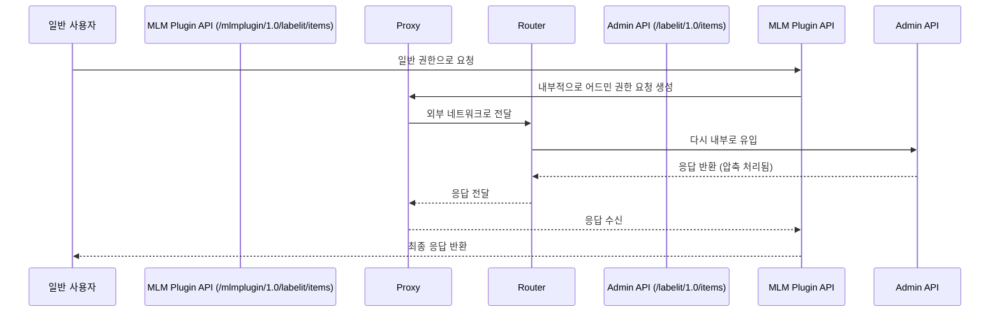

좋습니다 🙂 지금까지 말씀해주신 두 가지 이슈를 모두 반영해서 **최종 정리본(Jira 이슈 디스크립션 형식)**으로 정리해드릴게요.

---

# 📄 Jira Issues 최종 정리본

---

## Issue 1: MLM Plugin – CustomField 설정 캐시 초기화 문제

### Summary

Jira 클러스터 환경에서 MLM Plugin의 CustomField 설정 캐시가 `ServletContextListener`로 관리되어 노드별 초기화가 이루어지지 않는 문제

### Background

MLM Plugin 내부에서 사용하는 **CustomField 설정 캐시**가 `ServletContextListener`를 통해 관리되고 있습니다.  
이 구조로 인해 Jira 클러스터 환경에서 각 노드별로 캐시 초기화가 정상적으로 이루어지지 않고, 특정 노드에서만 초기화가 진행되는 문제가 발생합니다.

### Problem

- 클러스터 환경에서 `ServletContextListener` 기반 초기화가 모든 노드에서 동일하게 실행되지 않음
- 그 결과, **MLM Plugin의 CustomField 설정 캐시**가 노드별로 불일치하게 유지되어 기능 오류 가능성이 존재

### Cause

- `ServletContextListener`는 애플리케이션 서버 레벨에서 동작하지만, Jira Data Center 클러스터 환경에서는 노드별 초기화가 자동으로 보장되지 않음
- 캐시 관리가 클러스터 전역에서 동기화되지 않아 노드별 초기화가 누락됨

### Solution

- `CacheManager`를 활용하여 클러스터 환경에서도 노드별 캐시 초기화가 보장되도록 구조를 변경
- `PluginSetting`을 통해 읽은 **CustomField 설정**을 `CacheManager`에 반영하여 각 노드에서 캐시를 초기화하고 필요한 리소스를 로드하도록 개선

### Expected Result

- 모든 노드에서 동일하게 캐시 초기화가 수행되어 클러스터 환경 안정성이 확보됨
- **MLM Plugin의 CustomField 설정 캐시**가 일관되게 적용되어 기능 동작의 일관성을 유지할 수 있음
- 설정 불일치 문제를 방지하고, 향후 확장 시에도 노드별 초기화가 자동으로 보장되어 운영 효율성이 향상됨

---

## Issue 2: `/labelit/1.0/items` API – 어드민 권한 프록시 실행 문제

### Summary

`/labelit/1.0/items` API 어드민 권한 실행 시 프록시 구조 문제로 인해 세션 및 압축 처리 오류 발생

### Background

현재 `/labelit/1.0/items` API를 어드민 권한으로 실행할 때 프록시를 통해 요청이 전달되는 구조를 사용하고 있습니다.  
이 과정에서 세션 관리 및 라우팅 처리에서 문제가 발생했습니다.

### Problem

- 프록시 API 실행 시 **세션 꼬임 문제** 발생
- 요청이 외부로 전달된 뒤 라우팅 과정을 거쳐 다시 내부로 유입되는 과정에서 **이중 압축 문제** 발생
- 그 결과, API 응답이 비정상적으로 처리되거나 실패하는 사례 발생

### Cause

- 프록시 구조에서 세션 관리가 일관되게 유지되지 않아 세션 충돌 발생
- 라우팅 과정에서 중복된 압축 처리 로직이 적용되어 응답 데이터 손상
- nginx 설정에서 압축 및 헤더 전달 정책이 불완전하여 문제 악화

### Solution

- 현재 프록시 기반 구조를 **데이터베이스 직접 조회 방식**으로 전환

### Expected Result

- 세션 꼬임 문제 및 이중 압축 문제 해결
- `/labelit/1.0/items` API가 어드민 권한으로 안정적으로 실행됨
- 프록시 구조 제거 및 단순화된 아키텍처로 유지보수성 향상

---

👉 이렇게 두 가지 이슈를 **최종 정리본**으로 완성했습니다.  
원하시면 제가 이걸 **Jira 표준 템플릿 (Summary, Description, Steps to Reproduce, Actual Result, Expected Result)** 형식으로도 변환해드릴 수 있어요.
