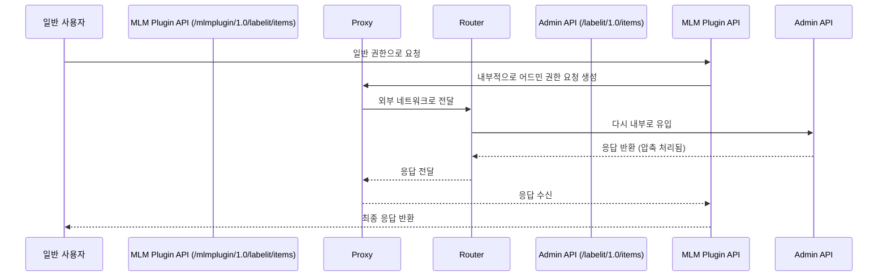

좋습니다 우용님 🙂 요청하신 대로 **최종 Jira 이슈 정리본**에 아까 작성했던 **Mermaid 다이어그램**을 포함해서 정리해드릴게요.

---

# 📄 Jira Issues 최종 정리본 (이모지 + 다이어그램 포함)

---

## 🧩 Issue 1: MLM Plugin – CustomField 설정 캐시 초기화 문제

### 📝 Summary

Jira 클러스터 환경에서 **MLM Plugin**의 **CustomField 설정 캐시**가 `ServletContextListener`로 관리되어 노드별 초기화가 이루어지지 않는 문제 ⚠️

### 📌 Background

MLM Plugin 내부에서 사용하는 **CustomField 설정 캐시**가 `ServletContextListener`를 통해 관리되고 있음.  
👉 이로 인해 클러스터 환경에서 각 노드별 초기화가 정상적으로 이루어지지 않고, 특정 노드에서만 초기화가 진행되는 문제가 발생.

### 🚨 Problem

- 클러스터 환경에서 `ServletContextListener` 기반 초기화가 모든 노드에서 동일하게 실행되지 않음 ❌
- 그 결과, **CustomField 캐시**가 노드별로 불일치하게 유지되어 기능 오류 발생 가능성 존재 ⚡

### 🔎 Cause

- `ServletContextListener`는 서버 레벨에서 동작하지만, Jira Data Center 클러스터 환경에서는 노드별 초기화가 자동 보장되지 않음 🖥️
- 캐시 관리가 클러스터 전역에서 동기화되지 않아 노드별 초기화 누락 발생 🌀

### 🛠️ Solution

- `CacheManager` 활용하여 클러스터 환경에서도 노드별 캐시 초기화 보장 ✅
- `PluginSetting`을 통해 읽은 **CustomField 설정**을 `CacheManager`에 반영하여 각 노드에서 캐시 초기화 및 리소스 로드 🔄

### 🎯 Expected Result

- 모든 노드에서 동일하게 캐시 초기화 수행 👍
- **MLM Plugin의 CustomField 캐시**가 일관되게 적용되어 기능 안정성 확보 🔐
- 설정 불일치 문제 방지 및 확장성 향상 🚀

---

## 🌐 Issue 2: `/mlmplugin/1.0/labelit/items` API – 어드민 권한 프록시 실행 문제

### 📝 Summary

👤 일반 사용자가 `/mlmplugin/1.0/labelit/items` API를 호출할 때 내부적으로 `/labelit/1.0/items`를 **어드민 권한**으로 요청하는 구조에서 프록시 및 nginx 설정 문제로 인해 **세션 꼬임**과 **이중 압축** 오류 발생 ⚠️

### 📌 Background

- 일반 사용자가 `/mlmplugin/1.0/labelit/items` API 호출
- 내부적으로 `/labelit/1.0/items` API를 **어드민 권한**으로 요청
- 요청이 프록시와 라우터를 거쳐 외부로 나갔다가 다시 내부로 유입되는 구조 🌐
- 이 과정에서 **세션 관리**와 **압축 처리** 문제 발생

### 🚨 Problem

- 프록시 API 실행 시 **세션 꼬임(Session Conflict)** 발생 🔒
- 라우팅 과정에서 **이중 압축(Double Compression)** 문제 발생 🗜️
- nginx 설정(`gzip`, `proxy_set_header`, 쿠키 전달 정책 등)이 불완전하여 문제 심화 ⚡

### 🔎 Cause

- 프록시 구조에서 세션 관리가 일관되지 않아 충돌 발생 🌀
- 라우팅 과정에서 중복 압축 처리로 응답 데이터 손상 💥
- nginx 설정 미비로 문제 악화 ⚠️

### 🛠️ Solution

- 프록시 기반 구조를 **DB 직접 조회 방식**으로 전환 🗄️
- nginx 설정 개선:
  - `gzip` 압축 설정 조정 🗜️
  - `proxy_set_header`, `X-Forwarded-*` 헤더 전달 정책 명확화 📑
  - 세션 쿠키 전달 설정(`proxy_cookie_path`, `proxy_cookie_domain`) 검토 🔐

### 🎯 Expected Result

- 세션 꼬임 및 이중 압축 문제 해결 ✅
- `/mlmplugin/1.0/labelit/items` API가 일반 사용자 요청을 안정적으로 처리하고 내부 어드민 호출도 정상 수행 👌
- nginx 설정 개선으로 안정적인 요청/응답 처리 가능 🌐
- 프록시 구조 제거 및 단순화된 아키텍처로 유지보수성 향상 🚀

---

## 📊 Mermaid 시퀀스 다이어그램 (Issue 2 흐름)

---

👉 이렇게 하면 **이모지 + 다이어그램**까지 포함된 최종 Jira 이슈 정리본이 완성되었습니다.  
원하시면 Issue 2 다이어그램에 **문제 포인트(세션 충돌, 이중 압축)**를 시각적으로 강조한 버전도 추가해드릴 수 있습니다.
